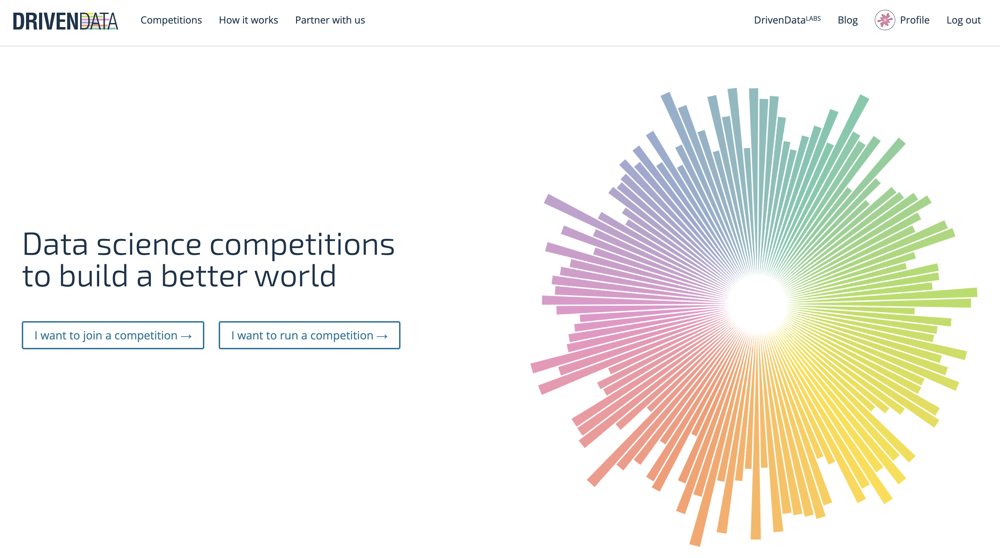

#### Introduction 
I started this project to start with using git on my personal account en experiment with some notebook settings.

##### Table of Contents  
[Date](#Start)   

[Context](#Context)

[Tech](#Tech)

##### Start
Dec 28, 2020

##### Context
Drivendata.org is a company that hosts online challenges for social data science projects. 
One of the projects includes analyzing the workage of waterpumps.

##### Tech
Git, venv, jupyter-notebooks, pandas, sklearn, matplotlib
